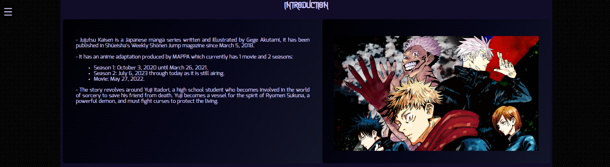

<h1>Memoria del proyecto fin de evaluación de Lenguajes de Marcas - 1º DAM/DAW</h1>
<h2>Jujutsu Kaisen - A tribute site</h2>
<h2>Indice</h2>
<ul>
  <li><a href="#introduccion">Introducción</a></li>
  <li><a href="#motivacion">Motivación</a></li>
  <li><a href="#estructura">Estructura</a></li>
  <li><a href="#estilo">Estilo</a></li>
</ul>

<h2 id="introduccion">Introducción</h2>

Trabajo realizado en clase por: Miguel Ángel Bonilla Fernández

Proyecto de web "from scratch" de 1ª evaluación de Lenguajes de Marcas

Diciembre de 2023

Licencia CC-BY

<h2 id="motivacion">Motivación</h2>

Para hacer esta página he seleccionado la serie Anime/Manga "Jujutsu-Kaisen", esto se debe a que es una de mis series favoritas, 
  tiene un diseño de personajes muy bueno y la trama en general de la serie es muy interesante. Debido a todo esto anterior quiero 
  que más personas la descubran y disfruten de ella.

<h2 id="estructura">Estructura</h2>

La web está dividida en  6 secciones:

<ul>
  <li>Hero Section</li>  
  <li>Introducción</li>
  <li>Arcos Argumentales</li>
  <li>Manga</li>
  <li>Personajes</li>
  <li>Footer</li>
</ul>

<h3>Hero Section</h3>

He utilizado esta imagen para la hero section puesto que me gustó la paleta de colores y aparecian los personajes principales. 
  Sobre ella he colocado un Call to Action que he estilado a raíz de lo dado en clase y los conocimientos adquiridos entonces.

<h3>Introducción</h3>

He dispuesto en un grid de 2 columnas....

.......

y aqui pongo <b>lo que quiera</b>

<h3>Footer</h3>

breve explicación 

<h2 id="estilo">Estilo de la página</h2>
<h3>Paleta de colores</h3>

.....

<h3>Tipografías</h3>

.....

<h3>Imágenes</h3>

.....

<h3>Videos</h3>

.....

...................
<h2 id="snippets">Code snippets</h2>

He utilizado los siguientes:

<ul>
  <li>Barra de navegación: tomada de w3Schools "How to" (poner vínculo)</li>
  <li>Accordion: ..............</li>
  <li>..........</li>
</ul>
