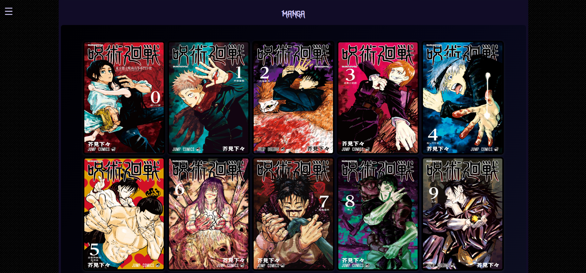
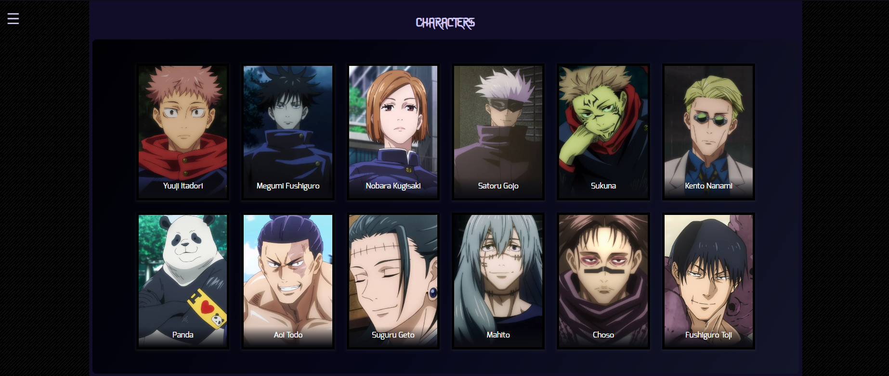
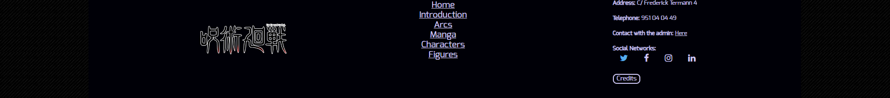

<h1>Memoria del proyecto fin de evaluación de Lenguajes de Marcas - 1º DAM/DAW</h1>
<h2>Jujutsu Kaisen - A tribute site</h2>
<h2>Indice</h2>
<ul>
  <li><a href="#introduccion">Introducción</a></li>
  <li><a href="#motivacion">Motivación</a></li>
  <li><a href="#estructura">Estructura</a></li>
  <li><a href="#estilo">Estilo</a></li>
</ul>

<h2 id="introduccion">Introducción</h2>

- Trabajo realizado en clase por: Miguel Ángel Bonilla Fernández

- Proyecto de web "from scratch" de 1ª evaluación de Lenguajes de Marcas

- Diciembre de 2023

- Licencia CC-BY

<h2 id="motivacion">Motivación</h2>

- Para hacer esta página he seleccionado la serie Anime/Manga "Jujutsu-Kaisen", esto se debe a que es una de mis series favoritas, 
  tiene un diseño de personajes muy bueno y la trama en general de la serie es muy interesante.
  - Debido a todo esto quiero que más personas la descubran y disfruten de ella.

<h2 id="estructura">Estructura</h2>

- La web está dividida en  6 secciones:

<ul>
  <li>Hero Section</li>  
  <li>Introducción</li>
  <li>Arcos Argumentales</li>
  <li>Manga</li>
  <li>Personajes</li>
  <li>Footer</li>
</ul>

<h3>Hero Section</h3>

- He utilizado esta imagen para la hero section puesto que me gustó la paleta de colores y aparecian los personajes principales. 
  - Sobre ella he colocado un Call to Action que he estilado a raíz de lo dado en clase y los conocimientos adquiridos entonces.

<h3>Introducción</h3>

- He dispuesto en un grid de 2 columnas algo de información sobre la serie en la primera y una imagen a buena calidad a la derecha. 
  - De fondo le he puesto un gradiente de color además de añadirle un borde redondeado para hacerlo más agradable a la vista

<h3>Arcos Argumentales</h3>

- He dispuesto en un grid de 4 columnas, en cada una de ellas aparecen algunos de los momentos de dicho arco en el anime, 
  junto al título y una descripción del mismo. 
  - Le he puesto de fondo un gradiente de color y le he añadido un borde redondeado por el mismo motivo que antes.

  <h3>Manga</h3>

- He dispuesto un div con display flex centrado, gracias a esto consigo que en cada uno de los div interiores tengan responsividad 
  automatica, es decir que no tengo que editar la responsividad a parte.  
  - Además le he añadido un efecto a las cards, que consiste en acercar la imagen, tener un fondo negro delante 
  con opacidad y añadirle un parrafo indicando el nº del volumen.

<h3>Personajes</h3>

- He dispuesto un div con display flex centrado, gracias a esto consigo que en cada uno de los div interiores tengan responsividad 
  automatica, es decir que no tengo que editar la responsividad a parte.  
  - Además le he añadido un efecto 3D a las cards, que consiste en rotar la imagen hacia atrás y conforme lo hace, aparece una imagen png 
  hacia arriba y se desliza un poco el nombre del personaje hacia la misma dirección.

<h3>Footer</h3>

- He añadido un footer dispuesto en un grid de tres columnas, donde la primera es el logo png de la serie, la segunda es un menú de la página 
y la última son datos de contacto y redes sociales con las que contactar con el administrador, además de un modal con el disclaimer y el enlace a la  
página oficial.

<h2 id="estilo">Estilo de la página</h2>
<h3>Paleta de colores</h3>

  - He seleccionado una paleta de colores de tonos azules morados y negro, ya que combinan bien con los colores de la serie.

<h3>Tipografías</h3>

  - Fuente Titulos: https://www.fontget.com/font/jujutsu-kaisen/  
  - Fuente Texto:  https://www.1001fonts.com/exo-font.html

<h3>Imágenes</h3>

  - Favicon: Inspeccioné en el siguiente enlace y saqué la imagen https://www.google.com/search?client=opera-gx&q=jujutsu+kaisen+wiki+fandom&sourceid=opera&ie=UTF-8&oe=UTF-8

  - Hero: https://www.google.com/url?sa=i&url=https%3A%2F%2Fes.bandainamcoent.eu%2Fjujutsu-kaisen%2Fnoticias%2Fjujutsu-kaisen-cursed-clash-se-lanza-el-2-de-febrero-del-2024&psig=AOvVaw0wfh29T1gnufCUR1hJrPka&ust=1699816233339000&source=images&cd=vfe&opi=89978449&ved=0CBEQjRxqFwoTCPDX-YjTvIIDFQAAAAAdAAAAABAE

  - Pattern: https://www.google.com/url?sa=i&url=https%3A%2F%2Fwww.designbolts.com%2F2012%2F11%2F26%2F25-free-simple-black-seamless-patterns-for-website-backgrounds%2F&psig=AOvVaw1AWLMnVjLreNAlt5zQxBPc&ust=1699816160633000&source=images&cd=vfe&opi=89978449&ved=0CBEQjRxqFwoTCODqmObSvIIDFQAAAAAdAAAAABAE

  - Footer image: https://www.google.com/url?sa=i&url=https%3A%2F%2Fen.wikipedia.org%2Fwiki%2FFile%3AJujutsu_Kaisen_%2528Japanese%2529_logo.svg&psig=AOvVaw20SbFtCSpc8kaDydQEcV9m&ust=1702855640774000&source=images&cd=vfe&opi=89978449&ved=0CBEQjRxqFwoTCIC38-KNlYMDFQAAAAAdAAAAABAt
    
  - Imagen de la section "Intro": https://www.mundodeportivo.com/alfabeta/series/ver-online-jujutsu-kaisen

  - Imagenes de la section "Arcos Argumentales": Las he sacado de una página fan https://jujutsu-kaisen.fandom.com/es/wiki/Jujutsu_Kaisen_Wiki

  - Imagenes de la section "Manga": Las he sacado de una página fan https://jujutsu-kaisen.fandom.com/es/wiki/Jujutsu_Kaisen_Wiki

  - Imagenes de la section "Characters": Las he sacado de una página fan https://jujutsu-kaisen.fandom.com/es/wiki/Jujutsu_Kaisen_Wiki
    

<h2 id="snippets">Code snippets</h2>

He utilizado los siguientes:

<ul>
  <li>Barra de navegación: tomada de w3Schools "How to" (poner vínculo)</li>
  <li>Modal: 
  <li>Manga card effect: tomada de la página Code Pen y editado por mi https://codepen.io/ritabradley_dev/pen/jOzMyqz</li>
  <li>Characters card effect: tomada del la página Code Pen y editado por mi https://codepen.io/gayane-gasparyan/pen/wvxewXO</li>
  <li>..........</li>
</ul>
